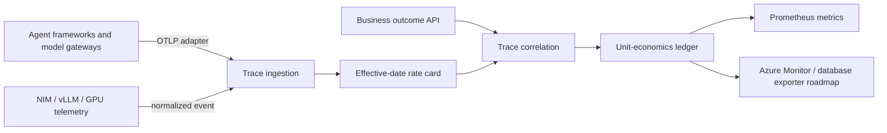

# Architecture and evidence boundaries

## Implemented now

- Authenticated JSON trace and outcome endpoints with strict one-megabyte request limits
- Duplicate-event and trace collision rejection
- Effective-date model, GPU and tool rate cards
- Trace-level cost, outcome, revenue, margin and retry-waste correlation
- Prometheus exposition, health checks, tests and non-root container packaging
- Helm deployment and a deliberately incomplete Azure foundation

## Not yet implemented

- Native OTLP/gRPC and OpenTelemetry Collector component interfaces
- Persistent PostgreSQL or ClickHouse ledger
- Azure Cost Management, OpenCost, DCGM and Foundry adapters
- mTLS/OIDC, tenant-level authorization, encryption keys and retention workflows
- GitOps routing proposals, shadow execution and verified-savings reconciliation

The repository must not be represented as a complete Collector distribution or production SaaS
until those capabilities and a threat model have been implemented and independently reviewed.
